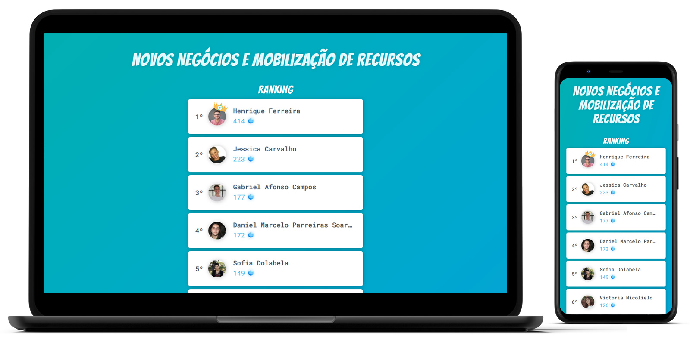

  

## MVP de Gamificação do Programa de Voluntariado

[Visualizar](https://voluntariadofortini.netlify.app)

### O que é?

Um sistema de gamificação para o Programa de Voluntariado da Fortini Investimento Social.

### Objetivo

Promover o engajamento, estudo e experiências dos voluntários enquanto os mesmos são reconhecidos e premiados.

### Como funciona?

Pontos serão distribuídos entre categorias predefinidas que serão representadas no nosso Trello através de etiquetas.

Os pontos são computados automaticamente quando os cards são concluídos.

### Stack

- React + styled-components
- axios _(API Trello)_
